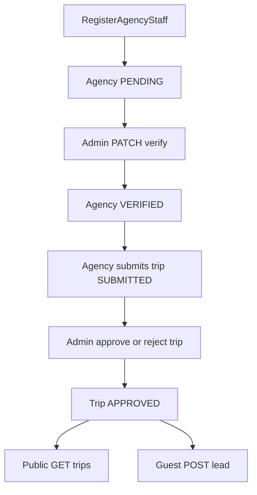

# Tour packages API — backend reference

**Living document.** When you change schemas, auth, routes, or workflows, update this file in the same PR so agents and humans stay aligned.

- **Stack:** NestJS 11, PostgreSQL, Prisma 7 (driver adapter + `pg`), JWT access/refresh, `class-validator` DTOs  
- **Deferred (not implemented here):** Redis/BullMQ, Resend email, SeaweedFS/S3 uploads (presigned URLs planned; stored image items may include optional `objectKey` for buckets later)

---

## Repo layout (`apps/api`)

| Path | Purpose |
|------|---------|
| `src/main.ts` | Bootstrap, global `ValidationPipe`, CORS, port from `PORT` (numeric) |
| `src/app.module.ts` | Root module wiring |
| `src/prisma/` | `PrismaService` — Prisma 7 + `@prisma/adapter-pg` using `DATABASE_URL` |
| `prisma/schema.prisma` | Data model (source of truth for tables) |
| `prisma.config.ts` | Prisma CLI config; loads `.env` via `dotenv/config`; datasource URL from `DATABASE_URL` |
| `prisma/migrations/` | Applied SQL migrations (created by `prisma migrate`) |
| `.env` / `.env.example` | Local secrets and DB URL (keep `.env` out of git; use `apps/api/.env`, not `src/.env`) |

---

## Environment variables

Copy [.env.example](./.env.example) to `apps/api/.env` and adjust.

| Variable | Role |
|----------|------|
| `DATABASE_URL` | PostgreSQL connection string (required for Prisma CLI **and** Nest `PrismaService`) |
| `JWT_ACCESS_SECRET` | Sign access tokens |
| `JWT_REFRESH_SECRET` | Sign refresh tokens |
| `JWT_ACCESS_TTL` | Access expiry (e.g. `15m`) |
| `JWT_REFRESH_TTL` | Refresh expiry (e.g. `7d`) |
| `PORT` | HTTP port (default Nest config treats as number, e.g. `3001`) |

**Prisma CLI:** `dotenv` loads `apps/api/.env` when commands run with cwd `apps/api` (or compatible).  
**Nest:** `ConfigModule.forRoot({ isGlobal: true })` reads env from the process; start the app from `apps/api` or export vars so `DATABASE_URL` exists at runtime.

---

## How to run locally

```bash
# From repo root — install API deps if needed
pnpm --dir apps/api install

# Generate Prisma Client (after schema changes)
pnpm --dir apps/api prisma generate

# Apply migrations (development) — creates/updates DB tables
pnpm --dir apps/api prisma migrate dev --name <short_description>

# Run API
pnpm --dir apps/api start:dev
# or from root
pnpm dev:api
```

Health check: `GET /health`

### PostgreSQL

Optional Docker services live at repo root: [docker-compose.yml](../../docker-compose.yml) (`postgres:16`, db/user/password `tour_packages`, port `5432`).

```bash
docker compose up -d postgres
```

Align `DATABASE_URL` with that compose file or your own Postgres instance.

### Prisma commands (cheat sheet)

| Goal | Command |
|------|---------|
| Create + apply migration from schema changes | `pnpm --dir apps/api prisma migrate dev --name ...` |
| Regenerate client only | `pnpm --dir apps/api prisma generate` |
| Production / CI apply existing migrations | `pnpm --dir apps/api prisma migrate deploy` |
| Inspect data | `pnpm --dir apps/api prisma studio` |

**Note:** `migrate dev` is interactive (can prompt for migration name / reset). Use `migrate deploy` in automated pipelines.

---

## Auth and roles

| Role | JWT `role` claim | Typical use |
|------|------------------|-------------|
| `AGENCY_STAFF` | `AGENCY_STAFF` | Agency dashboard actions |
| `ADMIN` | `ADMIN` | Moderation and admin-only routes |

### How users are created today

- **`POST /auth/register-agency-staff`:** Creates a new **Agency** (`status: PENDING`) and a **User** with `AGENCY_STAFF` linked to that agency. Does **not** verify the agency automatically.
- **`POST /auth/login`:** Email + password (bcrypt).
- **`POST /auth/refresh`:** Refresh token → new access + refresh pair.
- **Admin accounts:** There is **no public admin registration** endpoint. Seed an `ADMIN` user via DB/Prisma Studio/script as needed until a proper bootstrap flow exists.

Protect routes with `JwtAuthGuard` (+ `RolesGuard` + `@Roles(...)`).

---

## Domain rules (business logic snapshot)

High-level flow:



- **Trips (`POST /trips`):** Caller must be `AGENCY_STAFF` with an `agencyId`. Agency **`status` must be `VERIFIED`**. Creation sets trip to **`SUBMITTED`** with `submittedAt`.  
  Requires **≥ 3** `images` entries; each image is metadata (`originalName`, `size`, `mimeType`, optional `objectKey`, `sortOrder`).
- **Public trips:** `GET /trips` and `GET /trips/:id` only return **`APPROVED`** trips.
- **Leads (`POST /leads`):** **Unauthenticated.** Target trip must **`APPROVED`**. Stores `agencyId` from the trip for inbox scoping.
- **Agencies (`POST /agencies`):** For a user already `AGENCY_STAFF` **without** an `agencyId` — creates/links an agency profile. Separate from `/auth/register-agency-staff`, which creates both user + agency in one step.
- **Agency verification (`PATCH /admin/agencies/:id/verify`):** `ADMIN` only. Sets agency to **`VERIFIED`** and appends **`ModerationLog`** (`AGENCY` target, **`APPROVED`**). No reject/suspend workflow in API yet aside from schema enums.
- **Trip moderation (`PATCH /admin/trips/:id/approve|reject`):** Updates trip status and writes **`ModerationLog`** (`TRIP`).
- **Ratings (`POST /ratings`):** **Unauthenticated.** Numeric `score` (1–5); starts **`PENDING`**. **`PATCH /admin/ratings/:id/moderate`:** **`APPROVED`** or **`REJECTED`** on rating + **`ModerationLog`** (`RATING`).

---

## HTTP API surface (prefix: none — global routes)

Base URL example: `http://localhost:${PORT}`

| Method | Path | Auth | Notes |
|--------|------|------|-------|
| GET | `/health` | Public | Liveness-style payload |
| POST | `/auth/register-agency-staff` | Public | Creates agency + staff user |
| POST | `/auth/login` | Public | |
| POST | `/auth/refresh` | Public | Body: `refreshToken` |
| GET | `/auth/me` | JWT | |
| POST | `/agencies` | JWT `AGENCY_STAFF` | If user has no `agencyId` yet |
| GET | `/agencies/me` | JWT `AGENCY_STAFF` | |
| PATCH | `/admin/agencies/:id/verify` | JWT `ADMIN` | Sets verified + moderation log |
| POST | `/trips` | JWT `AGENCY_STAFF` | Requires verified agency |
| GET | `/trips` | Public | Approved only |
| GET | `/trips/:id` | Public | Approved only |
| PATCH | `/admin/trips/:id/approve` | JWT `ADMIN` | |
| PATCH | `/admin/trips/:id/reject` | JWT `ADMIN` | Body includes reason |
| POST | `/leads` | Public | Approved trip only |
| GET | `/agency/leads` | JWT `AGENCY_STAFF` | Scoped to caller agency |
| PATCH | `/agency/leads/:id/status` | JWT `AGENCY_STAFF` | |
| POST | `/ratings` | Public | Pending until moderated |
| PATCH | `/admin/ratings/:id/moderate` | JWT `ADMIN` | Approve/reject rating |

Bearer token: `Authorization: Bearer <accessToken>` for guarded routes.

---

## Database schema (tables & enums)

Prisma datasource: **PostgreSQL**. Table names match Prisma default mapping (model names PascalCase → quoted or mapped tables; **`@@map` not used** — default is lowercase pluralized identifiers per Prisma rules).

### Enums

| Enum | Values |
|------|--------|
| `Role` | `AGENCY_STAFF`, `ADMIN` |
| `AgencyStatus` | `PENDING`, `VERIFIED`, `REJECTED`, `SUSPENDED` |
| `TripStatus` | `DRAFT`, `SUBMITTED`, `APPROVED`, `REJECTED`, `ARCHIVED` |
| `TripKind` | `DOMESTIC`, `INTERNATIONAL` |
| `TripCategory` | `RELIGIOUS`, `NON_RELIGIOUS` |
| `PricingMode` | `STARTING_FROM`, `CUSTOM_QUOTE` |
| `LeadStatus` | `NEW`, `CONTACTED`, `QUOTED`, `CONFIRMED`, `LOST` |
| `RatingStatus` | `PENDING`, `APPROVED`, `REJECTED` |
| `ModerationTargetType` | `AGENCY`, `TRIP`, `RATING` |
| `ModerationDecision` | `APPROVED`, `REJECTED` |

### Models (entities)

**`User`**

| Field | Type / notes |
|-------|----------------|
| `id` | `uuid` PK (`@db.Uuid`) |
| `email` | unique |
| `passwordHash` | bcrypt |
| `fullName` | |
| `role` | `Role` |
| `agencyId` | optional FK → `Agency` |
| `moderationDecisions` | relation → `ModerationLog` |

**`Agency`**

| Field | Type / notes |
|-------|----------------|
| `id` | PK |
| `name`, `description`, `phone`, `email`, `website` | profile |
| `status` | `AgencyStatus` (default `PENDING`) |
| Relations | `staff` (users), `trips`, `leads`, `ratings` |

**`Trip`**

| Field | Type / notes |
|-------|----------------|
| Core copy | `title`, `summary`, `itinerary`, `cancellationPolicy` |
| Arrays | `destinations`, `religiousTags`, `departureMonths`, `inclusions`, `exclusions` |
| Classification | `kind`, `category`, `durationDays` |
| Pricing | `pricingMode`, `startingPriceCents?`, `currency` (default `USD`) |
| Workflow | `status`, `submittedAt`, `approvedAt`, `rejectedAt`, `rejectionReason` |
| `images` | `Json` (**JSONB**): array of `{ originalName, size, mimeType, objectKey?, sortOrder }` |
| Relations | `agency`, `leads`, `ratings` |

**`Lead`** (guest booking request)

Guest fields stored: name, phone, optional email, party size, preferred dates text, nationality/residence, message, `LeadStatus`.

**`Rating`**

`score` (int), `status` (`PENDING` → moderated), FKs to `trip` and `agency`.

**`ModerationLog`**

Append-only audit: `targetType`, `targetId`, `decision`, optional `reason`, `moderatorId` → `User`.

---

## Gaps vs product vision (tracked for future work)

- No email/redis queues; notifications not wired  
- No S3/presigned upload flow — images are metadata payloads only  
- Admin bootstrap, agency reject/suspend API, richer filters/search, traveler accounts — not in current API  
- ESLint flat config (`eslint.config.*`) not added for `apps/api`; `pnpm lint` may fail until configured

---

## Changelog stub (update when you merge backend changes)

| Date | Change |
|------|--------|
| _YYYY-MM-DD_ | Initial lean backend doc |
